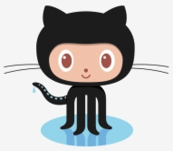
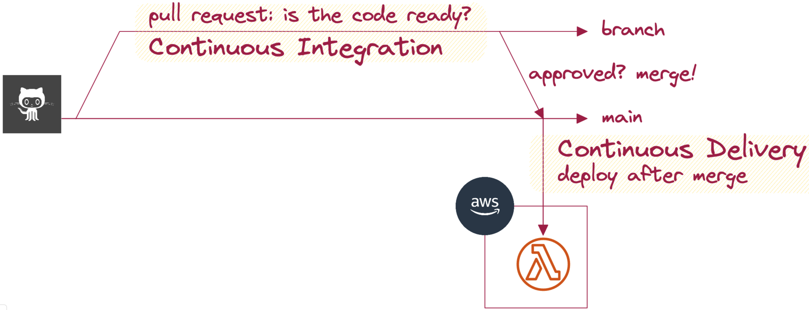
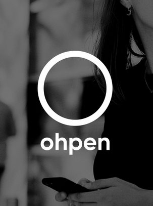
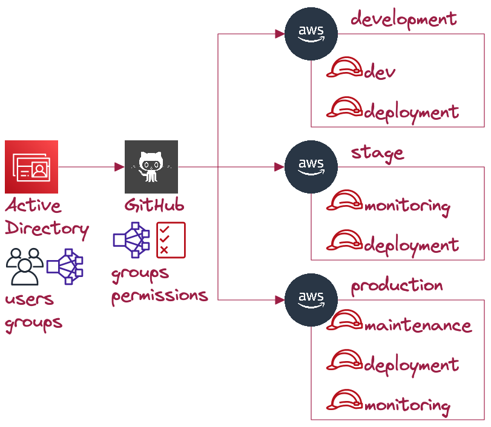

<!--
_class: invert
-->

# **Cloud and DevOps**

1. Hello Cloud
2. Software development
3. AWS & Serverless
4. Security in AWS
5. 👉 **Security, Testing & Cost management** 👈
6. Devops & CICD: Recap
7. Guest speaker

---

# **Previously in C&D ...**

Any questions about previous sessions and assignments?

---

---

# **Code in Github**

> Developers manage code in **branches** and create **pull requests** to **continuously integrate** their code to **main** branch.

Let's see it in the repository and Ohpen.

---

---

# **Quality Assurance**

- **Manual** testing: Everybody does it.
- **Unit**: Tests a single unit of code.
- **Integration**: Tests one use case. Service deployed.
- **End to end**: Tests a user story. Service deployed.
- Can you come up with examples?

---

# **CICD vs tests**

When should we use each type of testing?

- **Manual**: Fast, medium cost, bad coverage.
- **Unit**: Fast, low cost, limited coverage.
- **Integration**: Slow, medium cost, good coverage.
- **E2E**: Slower, medium cost, high coverage.

> Serverless architecture have shifted the paradigm.

---

# **IAM roles**

- Users belong to one person.
- Roles can be assumed if allowed.
- Roles don't have credentials but temporary keys.
- AWS services use IAM roles. [Let's see it](https://github.com/EduardBargues/bts_session5_13_06_2023).
- How are our lambdas allowed to access our Dynamodb?

---

# **Permissions at Ohpen**

- How users access AWS?
- How does Github deploy?
- How we ensure nobody can deploy from laptop?

---

---

# **AWS Cost explorer**

How can we oversee costs in AWS?

- Reports
- Budgets
- [Unblended vs Amortized](https://aws.amazon.com/blogs/aws-cloud-financial-management/understanding-your-aws-cost-datasets-a-cheat-sheet/)
- How does Ohpen do it? The importance of tags.

---

# **Conclusions**

- **IAM roles and SSO** scale up your permissions across your organization.
- IAM roles provide temporary credentials.
- Teams leverage **CICD** to **ensure** product **quality**.
- As a **PM**, we care about **integration** and **e2e** testing.
- **AWS Cost explorer** is the go-to solution for costs in AWS
